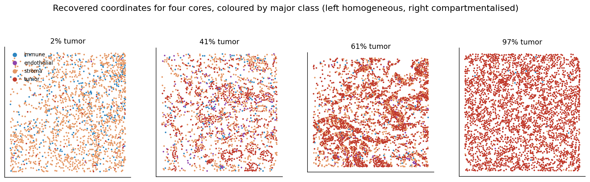
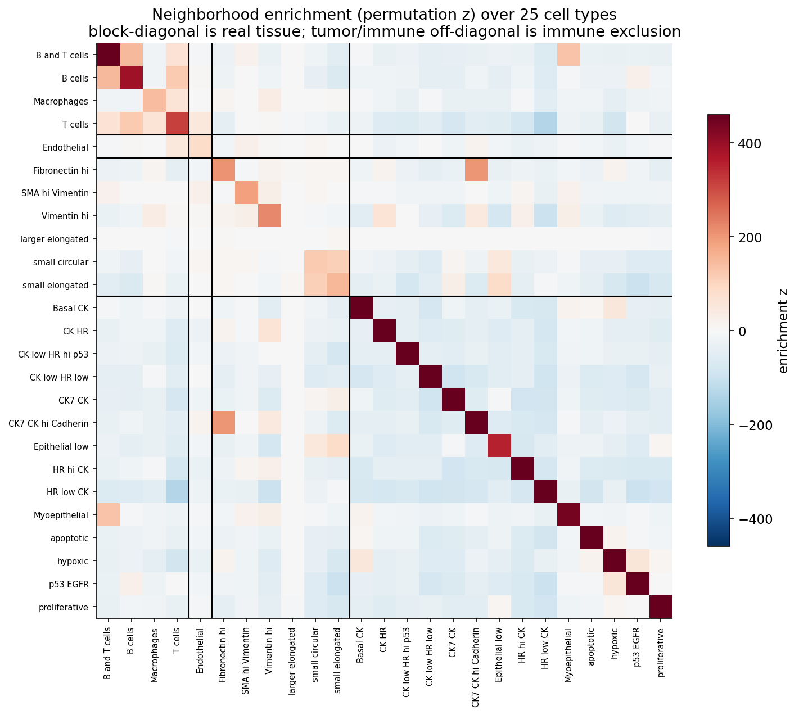
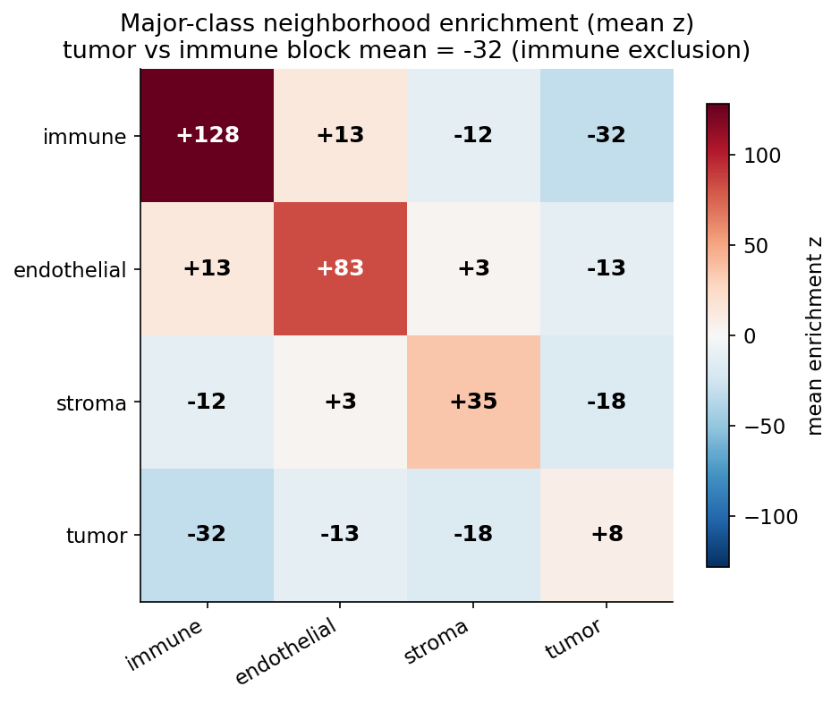
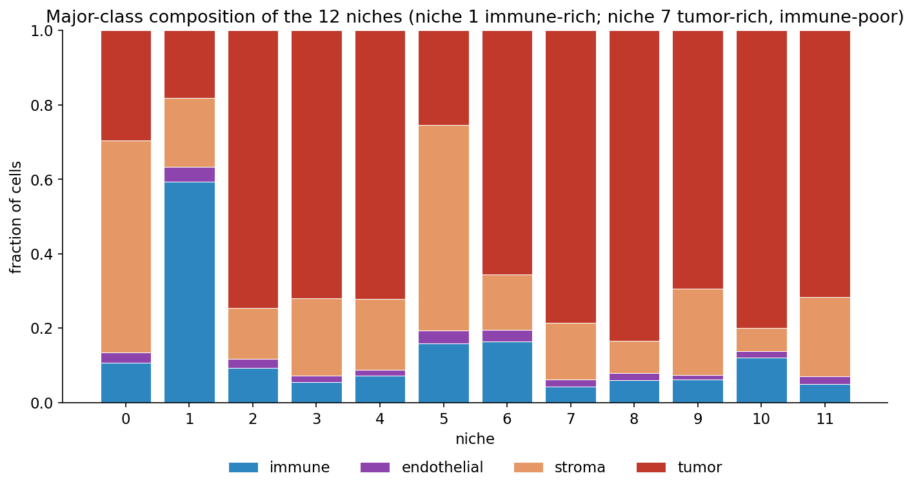
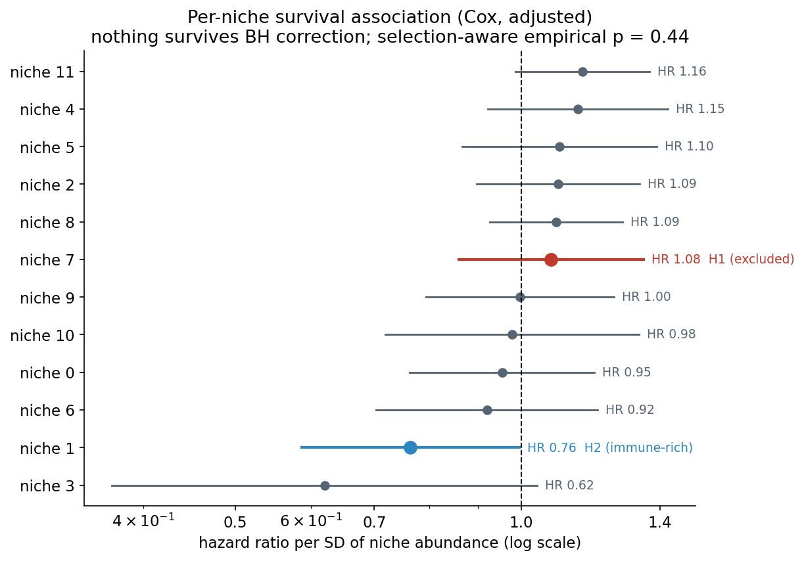
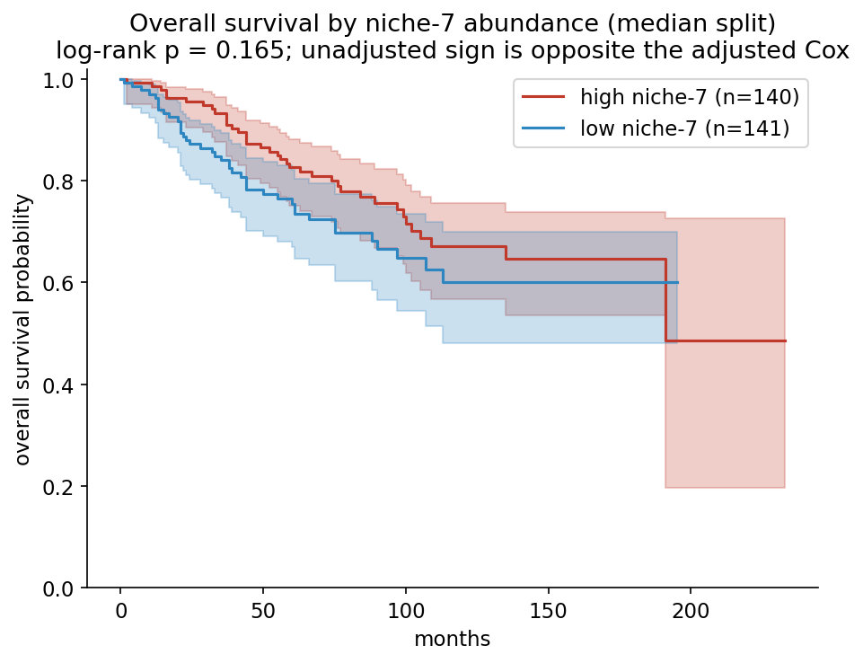

# Locale - Owkin Rewiring Biology Hackathon

Locale is an MCP server for spatial reasoning over tumor tissue. It gives an agent access to the spatial layout of a tissue, along with an estimate of how reliable that layout is for a given question.

Built for the Owkin Rewiring Biology Hackathon. Validated on the Basel breast cancer cohort of Jackson, Fischer et al. (Nature, 2020).

Two patients can have the same cell-type proportions and different outcomes, because the proportions do not record where the cells sit. Tools that read composition alone miss this. Locale reads the spatial arrangement, and it reports how reliable that reading is for the question being asked. That second part is deliberate: a confident but wrong answer is more harmful than no answer in a clinical setting, so the tools report their uncertainty alongside their results.



*Four cores from the cohort, every cell drawn at its recovered coordinate and coloured by major class (tumor red, stroma green, immune blue, endothelial purple). The leftmost core is 97% tumor and shows tissue nests and voids; the rightmost is 32% tumor, where immune and tumor cells fall into separate compartments. A wrong coordinate join would produce uniform confetti in every panel. The coordinates were recovered from segmentation masks and checked against the published per-core cell counts, which matched exactly.*

Three independent checks, and what each returned:

| Check | What it tests | Result |
| --- | --- | --- |
| Positive control | Recovers established biology it was never told about | Immune infiltration predicts better survival, HR 0.76, pre-registered |
| External validation | Rediscovers a Nature paper's spatial communities, cold | Adjusted Rand Index 0.400 over 342,662 cells |
| Negative control | Given 12 niches and only 79 events, declines to report a biomarker | Selection-aware empirical p = 0.44 |

The full write-up is in [docs/Locale_Technical_Report.pdf](docs/Locale_Technical_Report.pdf).

---

## Table of contents

1. [Motivation](#1-motivation)
2. [What Locale is](#2-what-locale-is)
3. [Results at a glance](#3-results-at-a-glance)
4. [Data provenance and retrieval](#4-data-provenance-and-retrieval)
5. [The coordinate problem](#5-the-coordinate-problem)
6. [Cell-type ontology](#6-cell-type-ontology)
7. [Cohort construction](#7-cohort-construction)
8. [Spatial graph](#8-spatial-graph)
9. [Neighborhood enrichment](#9-neighborhood-enrichment)
10. [Niche discovery](#10-niche-discovery)
11. [External validation](#11-external-validation)
12. [Pre-registration and survival analysis](#12-pre-registration-and-survival-analysis)
13. [The statistical honesty layer](#13-the-statistical-honesty-layer)
14. [Register of negative results](#14-register-of-negative-results)
15. [Reproducibility](#15-reproducibility)
16. [Repository layout](#16-repository-layout)
17. [Using the MCP server](#17-using-the-mcp-server)
18. [Limitations](#18-limitations)
19. [Citation, license, and contributors](#19-citation-license-and-contributors)

---

## 1. Motivation

Composition is not arrangement. A tumor that is 65% malignant cells, 12% immune cells, and 23% stroma may be one where lymphocytes have infiltrated the malignant compartment and are killing it, or one where they are held at the margin and do nothing. These two tissues give the same composition vector and the same bulk expression profile, but they can come from patients with very different outcomes.

Agentic tools over multi-omics data read the composition. They cannot read the arrangement. Locale reads the arrangement, and it reports how much that reading can be trusted for a given question. That second capability is what composition-only tools lack.

## 2. What Locale is

Locale is a Model Context Protocol (MCP) server. The analysis engine underneath it is a package of pure functions over a single `AnnData` object and contains no MCP code; the MCP tools are thin wrappers. That separation is what lets the analysis be tested without a running server.

The server exposes nine tools:

| Tool | Returns |
| --- | --- |
| `list_samples` | one record per image / core |
| `describe_sample` | cohort or single-image summary |
| `compute_enrichment` | neighborhood-enrichment matrix (cell type by cell type) |
| `find_niches` | the discovered niches with composition and marker program |
| `characterize_niche` | one niche in detail |
| `find_prognostic_niches` | niches ranked by survival association |
| `describe_niches` | the frozen niche catalog with honest names |
| `correlate_niche_outcome` | a niche's survival association plus the full statistical context |
| `get_map_payload` | tissue-map coordinates for the viewer |

`correlate_niche_outcome` never returns a bare p-value. It returns the hazard ratio, its confidence interval, the number of hypotheses tested, the Benjamini-Hochberg q-value, the selection-aware permutation p, the event count, the minimum hazard ratio the cohort can resolve at 80% power, and a verdict. See [section 13](#13-the-statistical-honesty-layer).

## 3. Results at a glance

| Quantity | Value |
| --- | --- |
| Cells analysed | 755,070 |
| Tumor cores | 289 |
| Patients | 281 |
| Death events | 79 |
| Overall survival range | 0 to 233 months, 0 missing |
| Cell types | 27 metaclusters (25 names), 4 major classes |
| Immune exclusion | tumor vs immune neighborhood z = -32 (block mean, see figure below) |
| Niches discovered (unsupervised) | 12, k selected by stability ARI = 0.67 |
| External agreement | ARI 0.400 versus 23 published tumor community phenotypes |
| Positive control (H2) | niche 1 immune-rich, HR 0.76 [0.59, 1.00], p = 0.046 |
| Pre-registered negative (H1) | niche 7 excluded, HR 1.08 [0.86, 1.34], p = 0.525 |
| Multiplicity | BH q > 0.29 for every niche |
| Selection-aware | empirical p = 0.44 (1,000 permutations) |

Every figure below is regenerated from the committed pipeline by [`scripts/make_figures.py`](scripts/make_figures.py).

## 4. Data provenance and retrieval

Source: Jackson, H.W., Fischer, J.R., et al. (2020), "The single-cell pathology landscape of breast cancer," Nature 578:615 to 620. Imaging mass cytometry on a breast cancer tissue microarray, 35 antibody channels, single-cell segmentation. Archive: Zenodo record `10.5281/zenodo.3518284`.

We read both archives (48 GB combined) by HTTP range request, without downloading them. A ZIP stores its central directory at the end of the file and each member occupies a contiguous compressed byte span, so with `Range` headers you can list the contents and extract individual members without transferring the rest. Zenodo returns HTTP 206, which confirms support. Two details have to be right, or the whole archive transfers by accident:

1. The naive approach (open a member and read a kilobyte) issues a range request from the member offset to the end of the file, which for an early member transfers nearly everything. We instead read the 30-byte local file header, parse the filename and extra-field lengths, compute the exact compressed span, and request that.
2. The central directory's extra-field length can differ from the local header's, so the local header has to be read directly.

About 5 GB was transferred out of 48 GB. The rest is OME-TIFF image stacks and MATLAB sessions the analysis does not use. See [`scripts/download_data.py`](scripts/download_data.py).

## 5. The coordinate problem

The released marker table `SC_dat.csv` is in long format with five columns (`core, CellId, id, channel, mc_counts`) and one row per cell-channel pair. There is no x, no y, and no coordinate file anywhere in the archive. The coordinates existed in the authors' MATLAB pipeline but were never exported in tabular form.

An IMC segmentation mask is a label image whose pixel value is the `CellId` within that core. So

```
regionprops(mask) -> (label, centroid) = (CellId, y, x)
```

recovers coordinates directly, with no inference. Two traps: `regionprops` returns the centroid as `(row, col)`, which is `(y, x)`, and swapping them silently transposes every tissue map; and the masks are bundled inside a nested archive that has to be range-fetched whole. See [`scripts/extract_coords.py`](scripts/extract_coords.py).

Mapping mask filenames to core identifiers is a pure transform, but the core number is the integer immediately before the `X..Y..` token, not the trailing integer. A first attempt keyed on the trailing token overlapped one real core. The corrected transform mapped 352, and the `X..Y..` tokens intersected 130 of 130, which showed the filenames could be mapped by a rule that applied to every core.

The join was verified two ways before any analysis ran:

- Injectivity. 376 mapped masks resolve to 376 distinct cores; the mapping is one to one.
- Per-core cell-count agreement. For every core, the cell count recovered from the mask equals the cell count in the PhenoGraph table exactly. All 376 of 376 cores agree (relative difference 0.0), including the 24 cores that required a metadata snap. A mis-mapped core would have carried a different count and been caught here. None was.

The recovery gives 844,498 cells across 376 of 376 cores, 0 duplicate ids, 0 NaN coordinates, and densities of roughly 2,500 cells per square millimetre, which is ordinary solid-tissue density.

## 6. Cell-type ontology

The PhenoGraph table assigns each cell to one of 71 clusters. These are not the granularity at which the paper's biology is stated. Jackson et al. collapse them into 27 curated metaclusters, hardcoded in their own pipeline. We transcribed that map verbatim (see [`src/localespatial/metaclusters.py`](src/localespatial/metaclusters.py) and Appendix A of the report); all 71 clusters map and none is orphaned.

The 27 metaclusters group into four major classes:

| Major class | Metacluster ids | PhenoGraph clusters | Cells |
| --- | --- | --- | --- |
| immune | 1 to 6 | 6 | ~122,000 |
| endothelial | 7 | 1 | ~20,000 |
| stroma | 8 to 13 | 6 | ~214,000 |
| tumor | 14 to 27 | 58 | ~399,000 |

This choice matters. 58 of the 71 PhenoGraph clusters are tumor subtypes, so analysis at PhenoGraph granularity falls apart: two adjacent cells in one tumor nest often land in different clusters, so "same type" becomes almost impossible to satisfy and real spatial coherence is diluted to noise. All clustering runs on metacluster id (27), not on names (25, because two pairs share a label), because the published communities we validate against were computed over the 27.

## 7. Cohort construction

`diseasestatus` has two levels, tumor (289 cores) and non-tumor (87 cores); the 87 non-tumor cores were dropped. We read the overall-survival event coding directly from the data. `Patientstatus` is a four-level string, and we set `event = 1` for both death levels and `0` for both alive levels.

| Quantity | Value |
| --- | --- |
| Cells | 755,070 |
| Tumor cores | 289 |
| Patients | 281 |
| Death events | 79 |
| Overall survival | 0 to 233 months, 0 missing |

See [`scripts/build_basel.py`](scripts/build_basel.py).

## 8. Spatial graph

```python
squidpy.gr.spatial_neighbors(adata, coord_type="generic", delaunay=True, library_key="core")
```

`coord_type="generic"` because IMC cells are not on a lattice. `library_key="core"` is the most dangerous parameter in the pipeline: this is a tissue microarray, cells in different cores are physically unconnected tissue, and a graph built without partitioning by core invents edges between them, which produces meaningless niches and raises no error. We check this explicitly: a guard function enumerates all edges and raises if any edge connects two cells from different cores.

The measured number of cross-core edges is 0. See [`src/localespatial/engine/graph.py`](src/localespatial/engine/graph.py).

## 9. Neighborhood enrichment

For each ordered pair of cell types, `squidpy.gr.nhood_enrichment` compares the observed number of graph edges connecting them against a null generated by permuting cell-type labels, and reports a z-score. This is composition-normalised: it answers whether two types sit adjacent more than chance given how much of each is present, which a raw same-type-neighbour fraction cannot do.



The block-diagonal structure (like sits next to like) is what real tissue produces: every diagonal block is strongly positive. Immune cells cluster with immune cells (block-mean z +128), endothelium self-associates at +83 even though it is only about 3% of cells (vessels are linear structures), and stroma is +35. Tumor self-enrichment is compressed to +8 because tumor is the majority class and has the least room to exceed its own permutation null.

The off-diagonal is where the biology sits. Tumor and immune cells avoid each other far more than their abundances would predict: the tumor vs immune block mean is z = -32.



The niche discovery recovers this independently: the immune-excluded niche 7 (section 10) is dominated by the HR-low-CK tumor phenotype, the tumor population that sits furthest from immune cells here. The exclusion is measured from the coordinates alone, with no reference to any published result.

The enrichment is computed over the 25 unique cell-type names (the two "T cells" and two "Macrophages" metaclusters merged into single cell types), which is the granularity the technical report and pitch quote. The 27 metacluster ids split those immune populations and average the same block to -22; the 25-name value is -32. Every figure here is regenerated from the committed pipeline by [`scripts/make_figures.py`](scripts/make_figures.py).

## 10. Niche discovery

For each cell $i$ with spatial neighbours $N(i)$ (self-inclusive), define the neighborhood composition $w_i \in \mathbb{R}^{27}$ as the fraction of $N(i)$ in each metacluster:

$$w_i = \frac{1}{|N(i)|} \sum_{j \in N(i)} e_{c(j)}, \qquad e_{c(j)} \in \{0, 1\}^{27}$$

computed as $W C \oslash (W \mathbf{1})$ where $W$ is the adjacency and $C$ the one-hot cell-type matrix. A niche is a cluster in $w$-space: a recurring kind of neighborhood. Clustering is k-means with `n_init=10` and a fixed seed. See [`src/localespatial/engine/niches.py`](src/localespatial/engine/niches.py).

One documented failure: the identity block. Our first specification concatenated each cell's own one-hot identity onto its window, giving a 54-dimensional feature. The resulting niches were degenerate; they were the metaclusters relabelled. The cause is metric geometry. The identity block is a one-hot of magnitude 1, while the window is a distribution spread over 27 entries, so in squared Euclidean distance the identity swamps every neighborhood difference and k-means partitions by label. This also passed the subsample-stability check, because a clustering that partitions by label is perfectly reproducible. A stable clustering is not necessarily a valid one. The final feature is the window alone (27-dimensional, self-inclusive), which is the standard Schurch and Nolan cellular-neighborhood formulation.

We chose `k = 12` by subsample stability (ARI between clusterings of independent resamples), with stability ARI = 0.67.



The full immune-exclusion gradient appears without supervision:

| Niche | Character | tumor | immune | stroma | cells | cores | dominant type |
| --- | --- | --- | --- | --- | --- | --- | --- |
| 1 | immune-rich (infiltrated) | 0.18 | 0.59 | 0.18 | 92k | 260 | T cells (47%) |
| 6 | tumor / immune boundary | 0.66 | 0.16 | 0.15 | 107k | 275 | Basal CK, hypoxic |
| 10 | tumor / immune boundary | 0.80 | 0.12 | 0.06 | 19k | 24 | p53 EGFR (70%) |
| 7 | tumor, immune-excluded | 0.79 | 0.04 | 0.15 | 75k | 160 | HR low CK (67%) |
| 0, 5 | stromal / vascular | ~0.27 | ~0.14 | ~0.56 | | | Vimentin, elongated |

Niche 7 spans 160 of the 289 tumor cores and 75,000 cells, so it reflects a real population across much of the cohort. Its dominant constituent is the hormone-receptor-low tumor phenotype, which is the clinically aggressive one. An immune-excluded compartment made of the aggressive subtype is coherent biology, and it is what motivated hypothesis H1.

## 11. External validation

Jackson et al. ran a conceptually equivalent analysis and archived their results. Basel is the one spatial oncology cohort with an external answer to score a tool like this against. We kept their answers sealed until the engine had produced its own.

Their ground truth is the recurring community phenotype, reached by a two-hop join: per-cell fine community to phenotype on `(core, Community)`, which yields a coarse label in 1 to 23. A first attempt joined on the 1,940-way fine community, which against our 12-way partition is mechanically meaningless and returned ARI 0.003; we reported nothing and looked into it. The corrected two-hop join matched 100% of their tumor cells. See [`scripts/run_basel_groundtruth.py`](scripts/run_basel_groundtruth.py).

The ARI is 0.400, computed over 342,662 tumor cells, comparing our 12 niches to their 23 published tumor community phenotypes. The two analyses used different algorithms, feature spaces, and values of k, so chance agreement is near zero, and exact agreement would have meant we reimplemented their method by accident. An ARI of 0.400 sits well above chance and points to independent agreement. The agreement is also localised: niche 7 falls into just 2 of their 23 communities, which account for 85% of its cells.

We also compared our enrichment matrix against the authors' published neighborhood heatmap and got a full Pearson r of 0.38, with off-diagonal r near 0.004. The correlation is carried entirely by the diagonal. In the tumor block the two statistics answer different questions, so we report this comparison as inconclusive and leave it out of our claims. We base the agreement claim on the ARI and treat r = 0.38 as inconclusive.

## 12. Pre-registration and survival analysis

Before any survival model was fitted, both hypotheses were written to [`PREREGISTRATION_survival.md`](PREREGISTRATION_survival.md) and timestamped. The file has not been changed since.

- H1: niche 7 abundance (tumor-rich, immune-depleted, HR-low-CK dominant) predicts worse overall survival.
- H2: niche 1 abundance (immune-rich, infiltrated) predicts better overall survival.

These two are confirmatory and carry no multiple-testing penalty. Every other niche is exploratory.

The candidate biomarker is a niche-abundance matrix. For each patient $p$ and niche $j$, the abundance $A_{pj}$ is the fraction of that patient's cells in niche $j$, which gives a 281 by 12 matrix.

We fit one Cox proportional-hazards model per niche, adjusted for grade and clinical subtype, with hazard ratios reported per standard deviation of abundance:

$$h(t \mid A_{\cdot j}) = h_0(t)\, \exp\!\big(\beta_j A_{\cdot j} + \gamma_1\,\mathrm{grade} + \gamma_2\,\mathrm{clinical\_type}\big)$$

The two pre-registered tests:

| Hypothesis | HR / SD | 95% CI | p |
| --- | --- | --- | --- |
| H2: niche 1 (infiltrated) to better OS | 0.76 | [0.59, 1.00] | 0.046 |
| H1: niche 7 (excluded) to worse OS | 1.08 | [0.86, 1.34] | 0.525 |

H2 holds. Tumor-infiltrating lymphocytes have been known to be prognostic in breast cancer for over a decade, so we treat this as a calibration check that the method responds to real signal. The interval's upper bound sits at exactly 1.00, so the result is marginal, and we say so. H1 does not hold: the direction matches the pre-registration, but the effect is null and the interval includes 1.



The unadjusted Kaplan-Meier split inverts the sign of the adjusted estimate. A median split of niche-7 abundance puts the high-exclusion arm slightly above the low arm (better survival), the opposite direction to both H1 and the adjusted Cox model. Both results are null, so they do not formally contradict, but the sign flips between specifications, which is the pattern you see when there is no real effect and the estimate follows noise and covariate adjustment.



Benjamini-Hochberg correction across all twelve niches gives q > 0.29 everywhere, so nothing survives correction.

A BH correction still assumes the twelve tests are the tests we meant to run. A stronger check asks: given that we would have reported whichever niche looked best, how surprising is our best result? We permute the survival labels across the 281 patients, refit all twelve Cox models, record the best p, and repeat 1,000 times. The empirical p is the fraction of permuted runs whose best p beats ours.

```
observed best p = 0.093   =>   empirical p = 0.44
```

Our best exploratory niche is consistent with noise once we account for having tested twelve.

For a leave-one-core-out check we refit the H1 model with each of the 289 cores removed in turn. The direction is stable (HR > 1 in 289 of 289 refits), but the magnitude never exceeds about 1.06 and is never significant, so no single core drives the result.

With 79 events across 281 patients, there are roughly 6 to 7 events per covariate at k = 12. At 80% power the cohort can only resolve hazard ratios beyond about 1.37, and the observed effects fall inside that band. The spatial signal is strong, but at this sample size it does not produce a defensible survival effect. The tool reports that limit directly: the data cannot rule out a clinically meaningful hazard ratio, and it cannot support one either.

## 13. The statistical honesty layer

`correlate_niche_outcome` returns all of this context in one call. It never returns a bare point estimate. For niche 1, the positive control, it returns this over the MCP protocol:

```json
{
  "niche_id": 1,
  "hazard_ratio": 0.764,
  "ci_95": [0.587, 0.995],
  "p_raw": 0.0458,
  "n_hypotheses_tested": 12,
  "q_fdr": 0.2903,
  "p_selection_aware": 0.4396,
  "n_events": 79,
  "min_detectable_hr": 1.371,
  "verdict": "insufficient evidence"
}
```

The raw p is 0.046, which an expression-only tool would report as a hit. The four fields an agent cannot compute for itself (`n_hypotheses_tested`, `q_fdr`, `p_selection_aware`, `min_detectable_hr`) ship with every finding, and they are what turn a plausible p-value into a supported or unsupported verdict. The minimum detectable hazard ratio is a Schoenfeld power calculation: with 79 events, effects inside [1/1.37, 1.37] are underpowered. See [`src/localespatial/engine/outcome.py`](src/localespatial/engine/outcome.py) and the demo transcript in [`demo/transcript.md`](demo/transcript.md).

## 14. Register of negative results

Recorded in full, since a methods writeup that lists only what worked is not much use to anyone checking it.

1. Coordinates absent from the marker table. Found at hour zero by reading the header. The project was gated on this and did not proceed until it was resolved.
2. Mask filename regex, first attempt. Keyed on the trailing integer, overlapped one real core. Corrected to the integer before the XY token, 352.
3. The sum-of-squares null for the neighbour test. Reported 6.7x enrichment. It assumes global composition and ignores per-core composition. Discarded.
4. The same-type-neighbour statistic. Even against the correct within-core scramble it returns about 1.07x, which met our pre-agreed stopping condition. It is uninformative for a majority-dominated cohort: the ratio decays to exactly 1.00 as cores become homogeneous, by construction. Replaced by composition-normalised enrichment.
5. The identity-plus-window niche feature. Produced degenerate niches that were metaclusters in disguise, and passed the stability check while doing so. Replaced with window-only.
6. ARI against the fine community id. Returned 0.003, a 1,940-way against a 12-way partition. A category error, fixed by the two-hop join.
7. Enrichment matrix correlation. r = 0.38 overall, near 0.004 off-diagonal. Inconclusive, left out of all claims.
8. Hypothesis H1. Pre-registered, and it failed. We left it as a failed prediction and did not rework it into a post-hoc ratio to cross 0.05.

Items 4 and 5 are cases where a metric gave a misleading answer and we caught it. Both are written up in [`reports/`](reports/).

## Future Clinical Direction

Locale measures a tissue phenotype that current companion diagnostics cannot
see. **None of the following is demonstrated in this cohort.** This section
states where the tool points, not what it has proven.

**Checkpoint inhibitor patient selection.** Immunotherapy works by releasing the
brakes on T cells, which means the T cells have to already be inside the tumor.
Infiltrated tumors respond. Excluded tumors, where T cells are present but held
at the stromal margin, usually do not. Immune deserts almost never do. The
approved companion diagnostic, PD-L1 immunohistochemistry, is a **composition**
assay: it counts protein. It cannot distinguish an infiltrated tumor from an
excluded one, and that is part of why it is a mediocre predictor. Locale
measures that distinction directly.

**Combination therapy selection.** An excluded tumor is a delivery failure, not
an immunological one: the T cells are there, they cannot get in. That argues for
breaking the barrier (stromal or TGF-beta targeting agents) before checkpoint
blockade. A desert tumor argues for something else entirely. Composition cannot
separate those two cases. Geography can.

**Trial enrichment.** A drug that only works on immune-excluded tumors will fail
an unenriched trial on a diluted effect. Spatial phenotyping is a screening
criterion.

**Prognostic refinement.** Some of the outcome variance unexplained by stage,
grade, and receptor status is architectural rather than compositional.

### Why we do not claim any of this

Basel is a historical breast cancer cohort. **No patient in it received a
checkpoint inhibitor.** We cannot test response prediction, so we do not.

Our own pre-registered survival hypothesis failed (selection-aware p = 0.44),
and Locale reported that failure rather than retuning until something crossed
0.05. A tool that would overclaim here would overclaim there.

Testing any of the above requires an ICI trial cohort with spatial data and
response labels. That is the next dataset, not the next paragraph.

## 15. Reproducibility

The engine is a package of pure functions over a single `AnnData` object and contains no MCP code; the MCP tools are three-line wrappers. It reads any `AnnData` carrying `obsm['spatial']`, a cell-type column, and a patient column, so pointing it at a different dataset takes a loader and no change to the analysis code.

| Component | Library |
| --- | --- |
| spatial graph, neighborhood enrichment | squidpy |
| data structures, preprocessing | scanpy, anndata |
| niche clustering, ARI | scikit-learn |
| survival models | lifelines |
| mask centroids | scikit-image, tifffile |
| partial archive retrieval | remotezip, requests |

```bash
python -m venv .venv && source .venv/bin/activate
pip install -r requirements.txt
pip install -e .                       # installs the localespatial package
python scripts/make_mock.py            # writes the committed data/mock.h5ad
pytest -q                              # 44 tests, all green

# real cohort (needs the extracted CSVs; see scripts/download_data.py)
python scripts/build_basel.py          # builds data/basel_niched.h5ad
python scripts/run_basel_niches.py     # niche discovery + enrichment sanity
python scripts/run_basel_survival.py   # pre-registered survival analysis
python scripts/make_figures.py         # regenerates docs/figures/
```

A note on the import path: the package is named `localespatial`, not `locale`, because a top-level `locale` package shadows the Python standard library `locale` module that `gettext` (inside click and uvicorn) imports, which breaks the server. The product is still called Locale; only the import path changed.

## 16. Repository layout

```
Locale/
  README.md                     this document
  LICENSE                       MIT
  pyproject.toml                package + tooling config
  requirements.txt
  PREREGISTRATION_survival.md   timestamped, never modified
  src/localespatial/
    schema.py                   shared Pydantic v2 data contract
    metaclusters.py             the 71 to 27 PhenoGraph map
    engine/                     pure analysis functions (Lane A)
      graph.py  enrichment.py  niches.py  characterize.py
      outcome.py  groundtruth.py  validate.py
    mcp_server/                 thin MCP wrappers (Lane B)
      server.py  tools.py  interpret.py
    viz/                        tissue-map viewer (Lane C)
  scripts/                      data build, analysis runs, figures
  tests/                        44 tests (engine, server, integration, schema)
  demo/                         frozen findings + K Pro transcript
  reports/                      two negative-result write-ups
  docs/
    Locale_Technical_Report.pdf full methods and statistics
    vision.md                   original project vision
    figures/                    regenerated by scripts/make_figures.py
  data/                         gitignored (only mock.h5ad is committed)
```

## 17. Using the MCP server

The server defaults to the streamable-http transport for remote use, for example as a K Pro custom connector at an `https .../mcp` URL. For a local desktop client it speaks stdio.

Run it directly:

```bash
python -m localespatial.mcp_server.server                          # streamable-http on 127.0.0.1:8000/mcp
LOCALE_TRANSPORT=stdio python -m localespatial.mcp_server.server   # stdio (desktop clients)
LOCALE_DATA=/path/to/basel_niched.h5ad LOCALE_TRANSPORT=stdio python -m localespatial.mcp_server.server
```

For Claude Desktop, add this to `claude_desktop_config.json`:

```json
{
  "mcpServers": {
    "locale": {
      "command": "/absolute/path/to/.venv/bin/python",
      "args": ["-m", "localespatial.mcp_server.server"],
      "env": {
        "LOCALE_TRANSPORT": "stdio",
        "LOCALE_DATA": "/absolute/path/to/data/basel_niched.h5ad"
      }
    }
  }
}
```

All logging goes to stderr so it cannot corrupt the stdio JSON-RPC stream. Without `LOCALE_DATA` the server reads the committed mock.

## 18. Limitations

- Power. 79 events is underpowered for modest hazard ratios. The negative result on H1 is a statement about this cohort, not about the biology.
- Single cohort. The Zurich cohort (about 70 patients) is in the same archive and is the natural external replication. We did not analyse it in the time available.
- Cell types come from the authors. We use their PhenoGraph assignments and metacluster map and did not re-derive cell types from the marker channels. This keeps the ARI comparison fair, but it means the pipeline has not been tested end to end from raw marker intensities.
- Breast cancer only, one platform (IMC on a TMA). Generalisation to spot-based spatial transcriptomics is supported by the design but untested.

## 19. Citation, license, and contributors

If you use Locale, please cite the dataset it is validated on: Jackson, Fischer et al., "The single-cell pathology landscape of breast cancer," Nature 578, 615 to 620 (2020).

Licensed under the MIT License; see [LICENSE](LICENSE).

Contributors: Sahiel Bose, Pranav Achar, Shanay Gaitonde.
